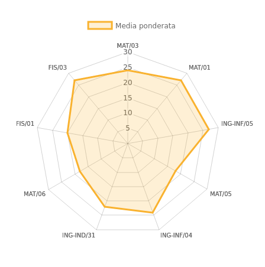

# Libretto delphi

Migliora la visualizzazione dei voti nel portale [Delphi](https://delphi.uniroma2.it) dell'Università degli Studi di Roma Tor Vergata con l'introduzione di grafici riassuntivi e con calcolo di voto di laurea.

## Screenshots

## Download
Non è ancora disponibile il download dal [Chrome Web Store](https://chrome.google.com/webstore/category/extensions) essendo incompleta riguardo il calcolo di voto di laurea (attualmente è disponibile solo per il corso di Ingegneria Informatica).

Non appena saranno aggiunti tutti i corsi di laurea provvederò a caricarla sullo store. 

È possibile comunque scaricare l'estensione dalla sezione [Release](https://github.com/pincopallino93/Libretto-Delphi/releases). 
Dopo aver effettuato il download del file .zip e averlo estratto in una cartella, è necessario attivare la *"Developer mode"* dalla pagina [chrome://extensions/](chrome://extensions/) e aggiungere **Libretto delphi** tramite il tasto *"Load unpacked extension..."* selezionando la cartella appena creata.

## Grafici
###Grafico radar

Mostra le medie per settore scientifico-disciplinare d'esame.
Ogni punto rappresenta la media in un settore scientifico-disciplinare

###Grafico a barre

Mostra il numero di voti conseguiti.
Ogni barra rappresenta una votazione sufficiente, maggiore è l'altezza della barra maggiore è il numero di volte che si è conseguito quel voto.

###Grafico a linee

Mostra l'andamento delle votazioni conseguite nel tempo.
Ogni punto rappresenta un voto e ad ogni votazione viene anche ricalcolata la media aritmetica e la media ponderata.

## Voto di laurea
Attualmente viene calcolato il voto di laurea solamente per i corsi di: 
* Filosofia [link](https://sites.google.com/site/segreterialettereuniroma2/home/come-fare-per/tesi-di-laurea/punti-assegnati-in-seduta-di-laurea), 
* Ingegneria Informatica [link](http://inginformatica.uniroma2.it/media/valut_pfin_trien16.pdf), 
* Lettere [link](https://sites.google.com/site/segreterialettereuniroma2/home/come-fare-per/tesi-di-laurea/punti-assegnati-in-seduta-di-laurea), 
* Beni Culturali [link](https://sites.google.com/site/segreterialettereuniroma2/home/come-fare-per/tesi-di-laurea/punti-assegnati-in-seduta-di-laurea),
* Lingue e Letteratuture Moderne [link](https://sites.google.com/site/segreterialettereuniroma2/home/come-fare-per/tesi-di-laurea/punti-assegnati-in-seduta-di-laurea),
* Lingue nella Società dell'Informazione [link](https://sites.google.com/site/segreterialettereuniroma2/home/come-fare-per/tesi-di-laurea/punti-assegnati-in-seduta-di-laurea),
* Scienza della Comunicazione [link](https://sites.google.com/site/segreterialettereuniroma2/home/come-fare-per/tesi-di-laurea/punti-assegnati-in-seduta-di-laurea),
* Scienze dell'Educazione e della Formazione [link](https://sites.google.com/site/segreterialettereuniroma2/home/come-fare-per/tesi-di-laurea/punti-assegnati-in-seduta-di-laurea),
* Scienze del Turismo [link](https://sites.google.com/site/segreterialettereuniroma2/home/come-fare-per/tesi-di-laurea/punti-assegnati-in-seduta-di-laurea).

Se vuoi che anche il tuo corso venga incluso apri una nuova [Issue](https://github.com/pincopallino93/Libretto-Delphi/issues) e linkami un documento in cui si spiega le modalità di calcolo o aggiungi tu stesso il codice necessario e crea una [Pull Request](https://github.com/pincopallino93/Libretto-Delphi/pulls) con la soluzione.

## Librerie
* [Chart.js](http://www.chartjs.org/): Simple, clean and engaging charts for designers and developers.
* [jQuery](https://jquery.com/): jQuery is a fast, small, and feature-rich JavaScript library.

##License
    The MIT License (MIT)
    
    Copyright (c) 2016 Claudio Pastorini
    
    Permission is hereby granted, free of charge, to any person obtaining a copy
    of this software and associated documentation files (the "Software"), to deal
    in the Software without restriction, including without limitation the rights
    to use, copy, modify, merge, publish, distribute, sublicense, and/or sell
    copies of the Software, and to permit persons to whom the Software is
    furnished to do so, subject to the following conditions:
    
    The above copyright notice and this permission notice shall be included in all
    copies or substantial portions of the Software.
    
    THE SOFTWARE IS PROVIDED "AS IS", WITHOUT WARRANTY OF ANY KIND, EXPRESS OR
    IMPLIED, INCLUDING BUT NOT LIMITED TO THE WARRANTIES OF MERCHANTABILITY,
    FITNESS FOR A PARTICULAR PURPOSE AND NONINFRINGEMENT. IN NO EVENT SHALL THE
    AUTHORS OR COPYRIGHT HOLDERS BE LIABLE FOR ANY CLAIM, DAMAGES OR OTHER
    LIABILITY, WHETHER IN AN ACTION OF CONTRACT, TORT OR OTHERWISE, ARISING FROM,
    OUT OF OR IN CONNECTION WITH THE SOFTWARE OR THE USE OR OTHER DEALINGS IN THE
    SOFTWARE.